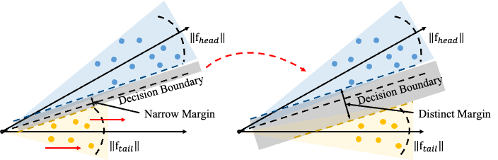

# FBL: Feature-Balanced Loss for Long-Tailed Visual Recognition
Mengke Li, Yiu-Ming Cheung†, Juyong Jiang.

(†) Corresponding Author.

This is the official source code for our ICME (2022) paper: [Feature-Balanced Loss for Long-Tailed Visual Recognition](https://www.computer.org/csdl/proceedings-article/icme/2022/09860003/1G9El1JiObK) based on Pytorch.

## Paper Abstract
Deep neural networks frequently suffer from performance degradation when the training data is long-tailed because several majority classes dominate the training, resulting in a biased model. Recent studies have made a great effort in solving this issue by obtaining good representations from data space, but few of them pay attention to the influence of feature norm on the predicted results. In this paper, we therefore address the long-tailed problem from feature space and thereby propose the feature-balanced loss. Specifically, we encourage larger feature norms of tail classes by giving them relatively stronger stimuli. Moreover, the stimuli intensity is gradually increased in the way of curriculum learning, which improves the generalization of the tail classes, meanwhile maintaining the performance of the head classes. Extensive experiments on multiple popular long-tailed recognition benchmarks demonstrate that the feature-balanced loss achieves superior performance gains compared with the state-of-the-art methods.

<p align="center">
  
  <br>
  <b>Figure 1.</b> The model architecture of the proposed FBL.
</p>

## Environment
* Pytorch 1.7.1
* Python 3.8.6

## CIFAR10
```bash
$ python train.py --arch resnet32 /
                  --dataset cifar10 --data_path './dataset/data_img' /
                  --gpu 3 /
                  --loss_type 'FeaBal' --batch_size 64 --learning_rate 0.1 --lambda_ 60
```
## CIFAR100
```bash
$ python train.py --arch resnet32 /
                  --dataset cifar100 --data_path './dataset/data_img' /
                  --gpu 3 /
                  --loss_type 'FeaBal' --batch_size 64 --learning_rate 0.1 --lambda_ 60
```
## ImageNet
```bash
$ python train.py --arch resnet50 / 
                  --dataset imagenet --data_path './dataset/data_txt' --img_path '/home/datasets/imagenet/ILSVRC2012_dataset' / 
                  --gpu 3 /
                  --loss_type 'FeaBal' --batch_size 512 --learning_rate 0.2 --lambda_ 150
```
## iNaturalist
```bash
$ python train.py --arch resnet50 / 
                  --dataset inat --data_path './dataset/data_txt' --img_path '/home/datasets/iNaturelist2018' / 
                  --gpu 3 /
                  --loss_type 'FeaBal' --batch_size 512  --learning_rate 0.2 --lambda_ 150
```

## Places
```bash
$ python train.py --arch resnet152_p / 
                  --dataset place365 --data_path './dataset/data_txt' --img_path '/home/datasets/Places365' /
                  --gpu 3 /
                  --loss_type 'FeaBal' --batch_size 512  --learning_rate 0.2 --lambda_ 150
```

## Bibtex
Please cite our paper if you find our code or paper useful:
```bibtex
@inproceedings{li2022feature,
  title={Feature-Balanced Loss for Long-Tailed Visual Recognition},
  author={Li, Mengke and Cheung, Yiu-Ming and Jiang, Juyong},
  booktitle={2022 IEEE International Conference on Multimedia and Expo (ICME)},
  pages={1--6},
  year={2022},
  organization={IEEE Computer Society}
}
```

## Contact
Feel free to contact us if there is any question. (Mengke Li, csmkli@comp.hkbu.edu.hk; Juyong Jiang, juyongjiang@ust.hk)